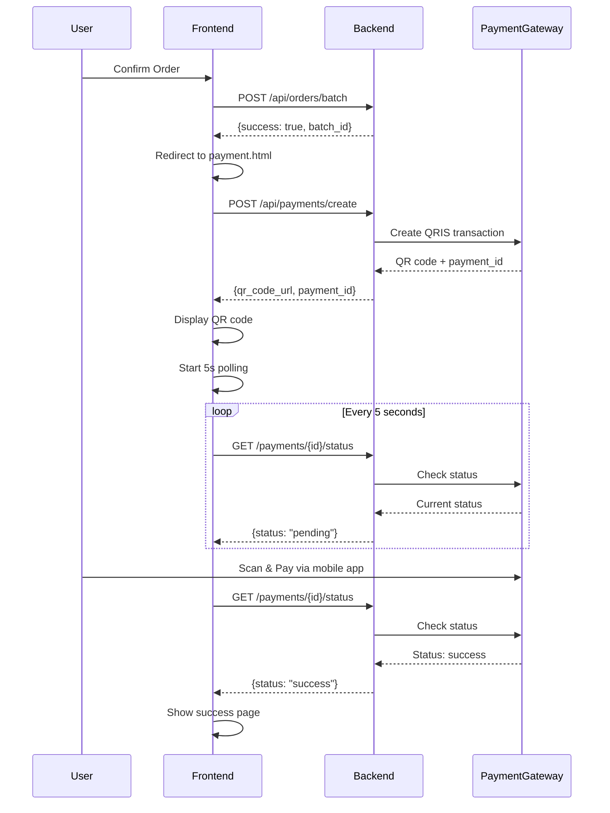

# Backend API Integration Guide

## Overview

This guide explains the backend API endpoints required for the Kuotaumroh.id order and payment system.

## Quick Start

### 1. Enable Production Mode

In [shared/api.js](file:///Users/iqbalzia/Documents/kode/Kuotaumroh%20migrate/shared/api.js#L14):

```javascript
const USE_MOCK_DATA = false; // Change to false when backend is ready
```

### 2. Update API Base URL

```javascript
const API_BASE = 'https://your-actual-api.com'; // Replace with your API
```

## Required Endpoints

### 1. Submit Order Batch

**Endpoint:** `POST /api/orders/batch`

**When Called:** After user confirms order on [order.html](file:///Users/iqbalzia/Documents/kode/Kuotaumroh%20migrate/order.html#L1524-L1537)

**Request Body:**
```json
[
  {
    "batch_id": "BATCH-1704869400000",
    "batch_name": "Order 10/01/2026 07:43",
    "msisdn": "081234567890",
    "provider": "TELKOMSEL",
    "package_id": "pkg123",
    "schedule_date": "2026-01-15T10:30:00.000Z"  // null if immediate
  },
  {
    "batch_id": "BATCH-1704869400000",
    "batch_name": "Order 10/01/2026 07:43",
    "msisdn": "081298765432",
    "provider": "INDOSAT",
    "package_id": "pkg456",
    "schedule_date": null
  }
]
```

**Expected Response:**
```json
{
  "success": true,
  "batch_id": "BATCH-1704869400000",
  "order_count": 2,
  "message": "Order batch created successfully"
}
```

**Error Response:**
```json
{
  "success": false,
  "error": "Invalid package_id",
  "message": "Package pkg123 not found"
}
```

---

### 2. Create Payment Transaction

**Endpoint:** `POST /api/payments/create`

**When Called:** On payment page load ([payment.html](file:///Users/iqbalzia/Documents/kode/Kuotaumroh%20migrate/payment.html#L468-L486) init)

**Request Body:**
```json
{
  "batch_id": "BATCH-1704869400000",
  "amount": 1500000,
  "payment_method": "qris"
}
```

**Expected Response:**
```json
{
  "success": true,
  "payment_id": "PAY-12345",
  "qr_code_url": "https://payment-gateway.com/qr/PAY-12345.png",
  "qr_string": "00020101021126580011ID...",
  "expires_at": "2026-01-10T08:00:00.000Z",
  "amount": 1500000
}
```

**What to do:**
1. Call your payment gateway (e.g., Midtrans, Xendit, Doku) to create QRIS transaction
2. Get the QR code image URL or string
3. Store payment transaction in your database
4. Return payment_id and qr_code_url to frontend

---

### 3. Check Payment Status

**Endpoint:** `GET /api/payments/{payment_id}/status`

**When Called:** 
- Automatically every 5 seconds ([payment.html](file:///Users/iqbalzia/Documents/kode/Kuotaumroh%20migrate/payment.html#L488-L510) polling)
- Manually when user clicks "Cek Status Pembayaran" button

**Expected Response:**
```json
{
  "success": true,
  "payment_id": "PAY-12345",
  "status": "success",  // "success" | "pending" | "expired" | "failed"
  "paid_at": "2026-01-10T07:50:00.000Z",
  "amount": 1500000
}
```

**What to do:**
1. Check payment status from your payment gateway
2. Update your database if status changed
3. Return current status to frontend

---

## Implementation Flow



## Testing

### 1. Test Order Submission

1. Open [order.html](file:///Users/iqbalzia/Documents/kode/Kuotaumroh%20migrate/order.html)
2. Fill out order (add phone numbers and select packages)
3. Click "Konfirmasi \u0026 Bayar"
4. Check browser console for:
   ```
   === BACKEND PAYLOAD ===
   [array of order items]
   ======================
   📤 MOCK: Submitting order batch to backend
   ```

### 2. Test Payment Creation

1. After order submission, you'll be redirected to payment.html
2. Check browser console for:
   ```
   💳 MOCK: Creating payment transaction
   ✅ Payment created: PAY-xxx
   ```
3. Mock QR code placeholder will be shown

### 3. Test Payment Status Check

1. On payment page, check console for:
   ```
   🔍 MOCK: Checking payment status for: PAY-xxx
   ```
2. Click "Cek Status Pembayaran" button
3. With 2% random chance, payment will succeed (for testing)

## Integration Checklist

- [ ] **Backend Team**: Implement `POST /api/orders/batch` endpoint
- [ ] **Backend Team**: Implement `POST /api/payments/create` endpoint  
- [ ] **Backend Team**: Implement `GET /api/payments/{id}/status` endpoint
- [ ] **Backend Team**: Integrate with payment gateway (Midtrans/Xendit/etc)
- [ ] **Frontend Team**: Set `USE_MOCK_DATA = false` in [shared/api.js](file:///Users/iqbalzia/Documents/kode/Kuotaumroh%20migrate/shared/api.js#L14)
- [ ] **Frontend Team**: Update `API_BASE` to production URL
- [ ] **Both Teams**: Test end-to-end order → payment → success flow
- [ ] **Both Teams**: Test error scenarios (invalid package, payment failure, etc)
- [ ] **Both Teams**: Test payment expiry (15-minute timeout)

## Error Handling

The frontend already handles these scenarios:

| Scenario | Frontend Behavior |
|----------|-------------------|
| Order submission fails | Shows error toast, stays on order page |
| Payment creation fails | Shows error toast, can't proceed |
| Payment status check fails | Logs error, continues polling |
| Payment expires (15 min) | Shows expiry page, redirects to order |
| Payment succeeds | Shows success page, redirects to history |

## Code Locations

All API functions are in [shared/api.js](file:///Users/iqbalzia/Documents/kode/Kuotaumroh%20migrate/shared/api.js):

- `submitOrderBatch()` - Line 362
- `createPaymentTransaction()` - Line 397
- `checkPaymentStatus()` - Line 434

## Support

If you need help:
1. Check browser console for detailed logs
2. All API calls are logged with emoji prefixes (📤 🔍 💳 ✅ ❌)
3. Mock mode shows exactly what data would be sent to backend
